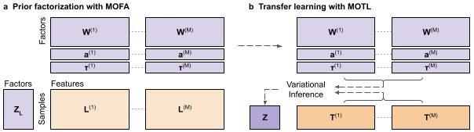

<!-- README.md is generated from README.Rmd. Please edit that file -->

# MOTL: multi-omics matrix factorization with transfer learning

<!-- badges: start -->

<!-- badges: end -->

If you use MOTL, please cite our publication:

Hirst, D.P., Térézol, M., Cantini, L. et al. MOTL: enhancing multi-omics
matrix factorization with transfer learning. Genome Biol 26, 224 (2025).
<https://doi.org/10.1186/s13059-025-03675-7>.

MOTL infers latent factor values for a multi-omics target dataset,
consisting of a small number of samples, by incorporating latent factor
values already inferred with a MOFA factorization of a large,
heterogeneous, learning dataset.

<p align="center">


</p>

Overview of MOTL, our transfer learning approach to joint multi-omics
matrix factorization based on variational Bayesian inference.

**a** : A multi-omics learning dataset, $\boldsymbol{L}$, consisting of
$M$ omics matrices, $\boldsymbol{L}^{(m)}$, $m=1,...,M$, is factorized
with MOFA to infer a matrix of feature weights, $\boldsymbol{W}^{(m)}$,
vector of feature-wise intercepts, $\boldsymbol{a}^{(m)}$, and a vector
of feature-wise precision parameter values, $\boldsymbol{\tau}^{(m)}$,
for each $\boldsymbol{L}^{(m)}$.

**b** : The feature weight, intercept, and precision parameter values,
inferred from the factorization of $\boldsymbol{L}$, are incorporated
into the factorization of a multi-omics target dataset,
$\boldsymbol{T}$, for which MOTL infers a matrix of sample scores,
$\boldsymbol{Z}$, with variational inference.

## Installation

You can install the development version of MOTL from
[GitHub](https://github.com/) with:

``` r
install.packages("devtools")
devtools::install_github("MOohTus/MOTL-pkg")
```

## How to use MOTL

### Load libraries

Load libraries needed for the analysis

``` r
library("MOTL")
library("MOFA2")
```

### Preprocessing of learning dataset factorization

The TCGA learning dataset factorization files, created in a frame of the
paper, are available in [Zenodo](https://zenodo.org/records/10848217).

``` r
LrnDir <- "LrnData"
LrnFctrnDir <- file.path(LrnDir, "Lrn_5000D_Fctrzn_100K_001TH")
```

Specify whether to center the target dataset during processing or to
leave uncentered and use estimated learning dataset intercepts

``` r
CenterTrg <- FALSE
```

Import the learning dataset metadata, factorization, and initialise
values

``` r
## Import learning data
expdat_meta_Lrn <- readRDS(file.path(LrnDir, "expdat_meta.rds"))
InputModel <- file.path(LrnFctrnDir, "Model.hdf5")
Fctrzn <- load_model(file = InputModel)

## Initialise values from factorization
viewsLrn <- Fctrzn@data_options$views
likelihoodsLrn <- Fctrzn@model_options$likelihoods
MLrn <- Fctrzn@dimensions$M

Fctrzn@expectations[["Tau"]] <- Tau_init(viewsLrn, Fctrzn, InputModel)
Fctrzn@expectations[["TauLn"]] <- sapply(viewsLrn, TauLn_calculation, likelihoodsLrn, Fctrzn, LrnFctrnDir)
Fctrzn@expectations[["WSq"]] <- sapply(viewsLrn, WSq_calculation, Fctrzn, LrnFctrnDir)
Fctrzn@expectations[["W0"]] <- sapply(viewsLrn, W0_calculation, CenterTrg, Fctrzn, LrnFctrnDir)
```

### Preprocessing of target dataset factorization

Create a list of the matrices, using the following naming convention for
each omics. See the `vignette("MOTL", package = "MOTL")` for more
details about the format of these matrices.

``` r
YTrg_list <- list(
  mRNA = "expdat_mRNA",
  miRNA = "expdat_miRNA",
  DNAme = "expdat_DNAme",
  SNV = "expdat_SNV"
)
```

Initialise values for transfer learning

``` r
smpls <- colnames(YTrg_list[[1]])
viewsTrg <- names(YTrg_list)
views <- viewsLrn[is.element(viewsLrn, viewsTrg)]
likelihoods <- likelihoodsLrn[views]

YTrg_prep <- TargetDataPreparation(views = views, YTrg_list = YTrg_list,
                                       Fctrzn = Fctrzn,
                                       smpls = smpls,
                                       normalization = "LrnGeoMeans",
                                       expdat_meta_Lrn = expdat_meta_Lrn,
                                       transformation = TRUE)

TL_param <- initTransferLearningParamaters(YTrg = YTrg_prep, 
                                           views = views, 
                                           Fctrzn = Fctrzn, 
                                           likelihoods = likelihoods)
```

### Transfer learning factorization with MOTL

Specify output folder and parameters for MOTL. See the
`vignette("MOTL", package = "MOTL")` for more details about the input
parameters.

``` r
TL_OutDir <- 'MOTL_Fctrzn'

ss_start_time <- Sys.time()
minFactors <- 6 
StartDropFactor <- 1 
FreqDropFactor <- 1 
StartELBO <- 1 
FreqELBO <- 5 
DropFactorTH <- 0.01 
MaxIterations <- 10000
MinIterations <- 2 
ConvergenceIts <- 2 
ConvergenceTH <- 0.0005 
```

Run MOTL to infer and save the factorization as an rds file

``` r
TL_data <- transferLearning_function(TL_param = TL_param, 
                                     views = views,
                                     likelihoods = likelihoods,
                                     Fctrzn = Fctrzn,
                                     CenterTrg = CenterTrg,
                                     MaxIterations = MaxIterations, 
                                     MinIterations = MinIterations,
                                     minFactors = minFactors, 
                                     StartDropFactor = StartDropFactor, 
                                     FreqDropFactor = FreqDropFactor, 
                                     StartELBO = StartELBO, 
                                     FreqELBO = FreqELBO, 
                                     DropFactorTH = DropFactorTH,
                                     ConvergenceIts = ConvergenceIts, 
                                     ConvergenceTH = ConvergenceTH,
                                     ss_start_time = ss_start_time)
```

Extract the Z and W matrices from the MOTL factorization. Z is the
inferred score matrix for the target dataset: rows are samples, and
columns are factors. Each W has features in the columns and factors in
the rows. Factor names correspond to the name from the learning dataset
factorization.

``` r
ZMu <- TL_data$ZMu
W_mRNA <- TL_data$Fctrzn_Lrn_W$mRNA
```
